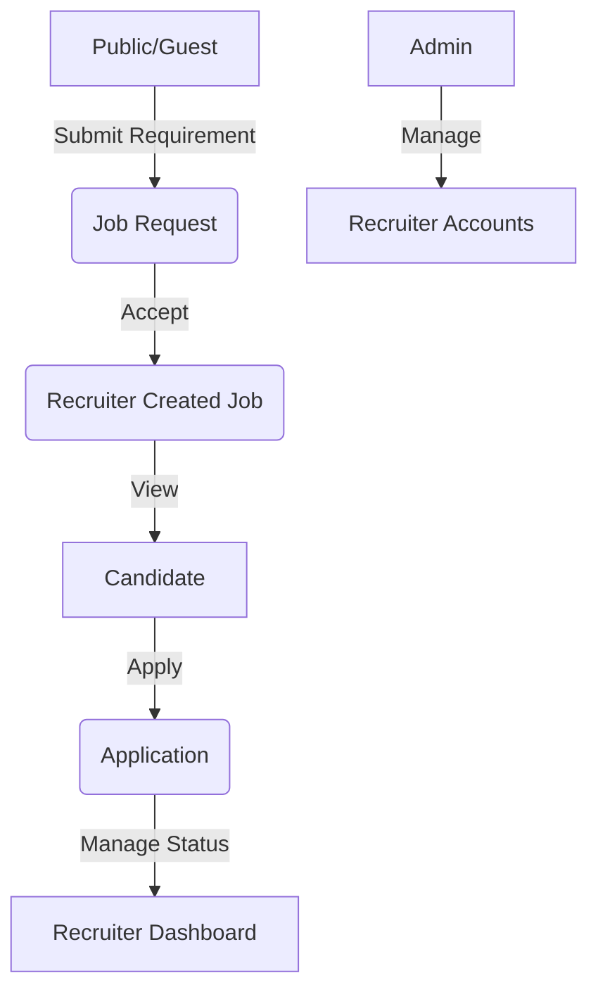

# RecruitHub Functional Flow Document

This document outlines the operational flows and user journeys within the RecruitHub platform.

## 1. User Roles & Permissions

- **Platform Admin:** System-level management, recruiter onboarding, and monitoring.
- **Recruiter (Agency):** Manages hiring pipelines for multiple client companies.
- **Client (Guest):** Submits hiring requirements to the platform.
- **Candidate:** registered users who search and apply for jobs.

---

## 2. Core Functional Flows

### A. Authentication & Onboarding
1. **Candidate Registration:** Guests can sign up as candidates by providing email, password, and basic profile details.
2. **Secure Login:** All registered users (Admin, Recruiter, Candidate) authenticate via JWT.
3. **Role-Based Redirection:** Upon login, the system detects the user role and redirects to the appropriate dashboard:
   - `/admin/dashboard`
   - `/recruiter/dashboard`
   - `/candidate/dashboard`

### B. Admin Flow (Platform Management)
1. **Recruiter Onboarding:** Admin creates agency accounts by providing company details and credentials.
2. **Access Control:** Admin can enable/disable recruiter accounts as needed.
3. **Analytics:** View total platform metrics (Total Users, Jobs, Applications).

### C. Recruiter Flow (The Lifecycle Management)
1. **Client Management:** Recruiters add and manage 'Client Companies' and their relevant 'Departments'.
2. **Job Posting:** 
   - Recruiters create vacancies linked to a specific company and department.
   - Jobs can be set to OPEN, ON_HOLD, or CLOSED.
3. **Requirement Intake:**
   - Recruiters review guest 'Job Requests'.
   - They decide to ACCEPT (convert to a job) or REJECT the request.
4. **Application Management:**
   - Review incoming applications from candidates.
   - Update status: APPLIED → SHORTLISTED → REJECTED → ON_HOLD.
   - Add internal recruiter notes for evaluation.

### D. Client Flow (Requirement Submission)
1. **Browse Partners:** Guest companies view a list of recruitment agencies.
2. **Submit Requirement:** Companies fill out a "Submit Requirement" form (Contact details + Job description).
3. **Notification:** The request appears instantly on the selected recruiter's dashboard.

### E. Candidate Flow (The Job Search)
1. **Job Exploration:** Search and filter through all available "OPEN" job postings.
2. **Profile Enrichment:** Candidates update their skills, experience, and LinkedIn profile.
3. **Resume Management:** Upload CV (PDF/DOCX) for recruiters to download.
4. **Application:** Apply for jobs with a single click.
5. **Tracking:** Monitor real-time status updates from recruiters (e.g., getting shortlisted).

---

## 3. Data Flow Architecture

## 4. Key UI Features
- **Glassmorphism Design:** Modern, translucent UI components.
- **Real-time Feedback:** SUCCESS/ERROR toasts for every action.
- **Responsive Layout:** Optimized for both Desktop and Mobile use.
- **JWT Security:** Authorization headers automatically attached to all protected API calls.
